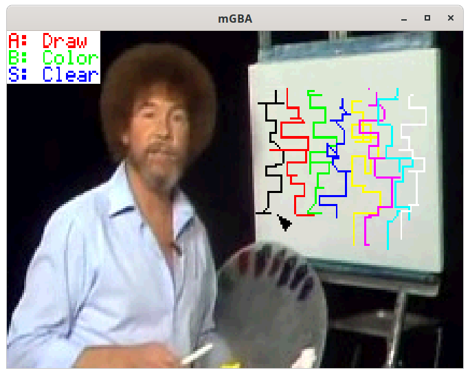

# Embedded Graphics Game Boy Advance Display

This crate implements the [embedded-graphics](https://github.com/jamwaffles/embedded-graphics) `DrawTarget` trait for the Game Boy Advance. This works when the GBA's display is used in a bitmap mode: `Mode3`, `Mode4`, or `Mode5`.

The GBA `Tile4bpp` and `Tile8bpp` objects also accept `Drawable` items to create sprites.

`PaletteColor` is a custom `PixelColor` that represents an index into a GBA color palette.

## Example

The [draw.rs](./examples/draw.rs) example loads a background image using the [tinytga](https://crates.io/crates/tinytga) crate. Use the <kbd>D-pad</kbd>, <kbd>A</kbd> button, and <kbd>B</kbd> button to draw over the background. The <kbd>start</kbd> button clears the screen. The [gba](https://github.com/rust-console/gba) crate builds the example into a GBA ROM.
